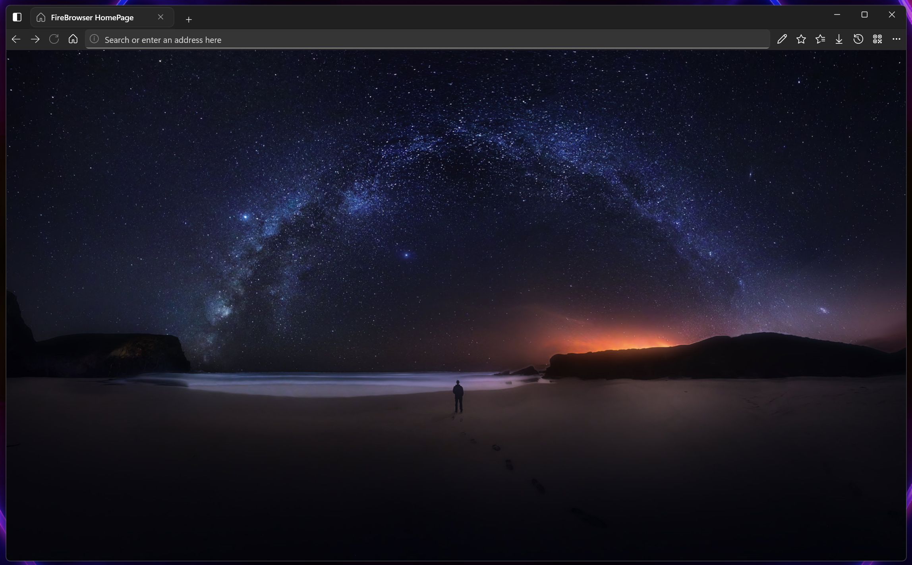
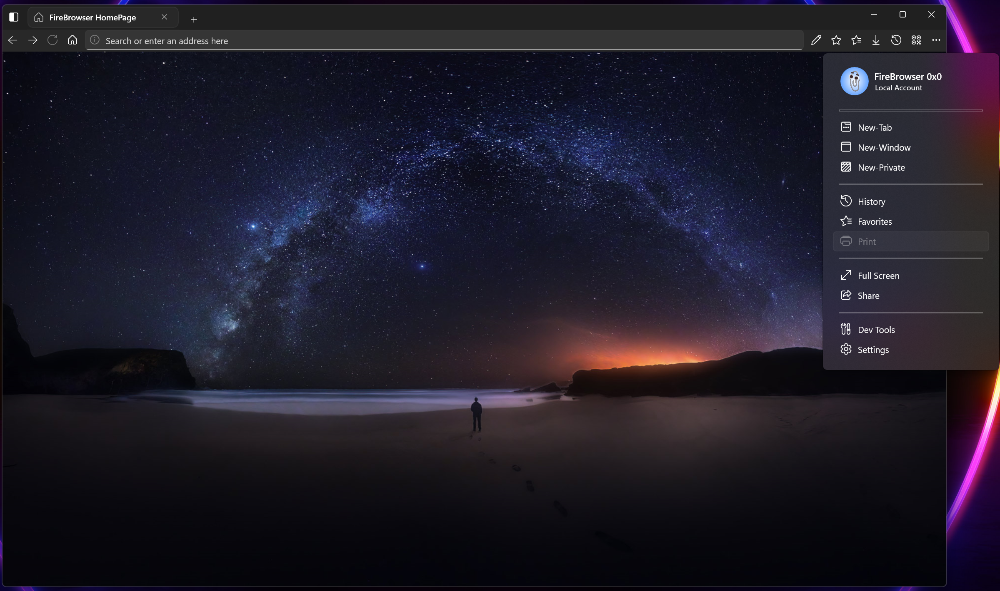
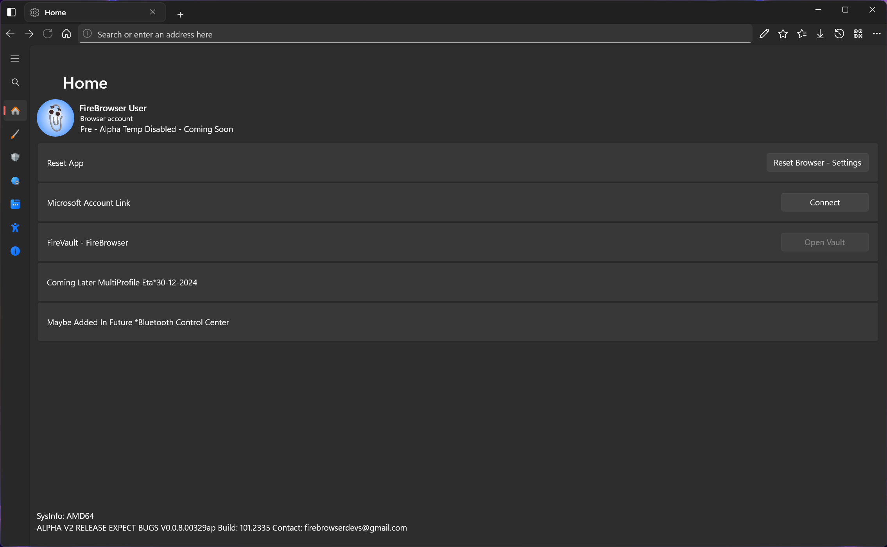
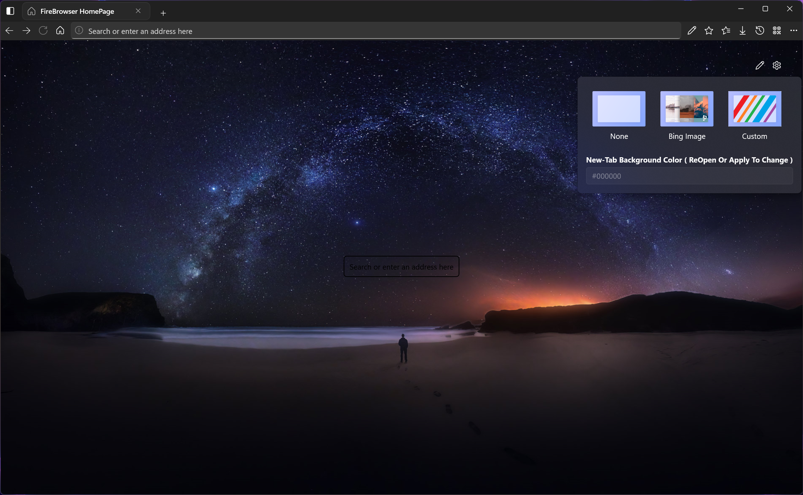

  
  <h1>FireBrowser</h1>

### A modern Web browser with a beautiful UI built with the UWP/WinUI3 and the WebView2 SDK.

# Features:
- Blazingly fast
- Low ram usage
- Browse the web
- Search suggestions
- Reading mode
- QR Code generator
- Pinned sites
- Focus mode
- Note on websites
- Compact overlay
- Split browsing
- Freeform

# Upcoming Stuff Eta 31 - Dec - 2023
- AES 256 random key genarated encryption for storing credit data en autofill

# NOTE:
if your building the project on windows 10 make sure to use the 2004 sdk as that works best for 22h2 and any older build that supports visual studio 2022.

# Screenshots

   
   
   
   

# License

https://github.com/FirebrowserDevs/FireBrowser-Uwp/blob/main/LICENSE

GPL v3.0
