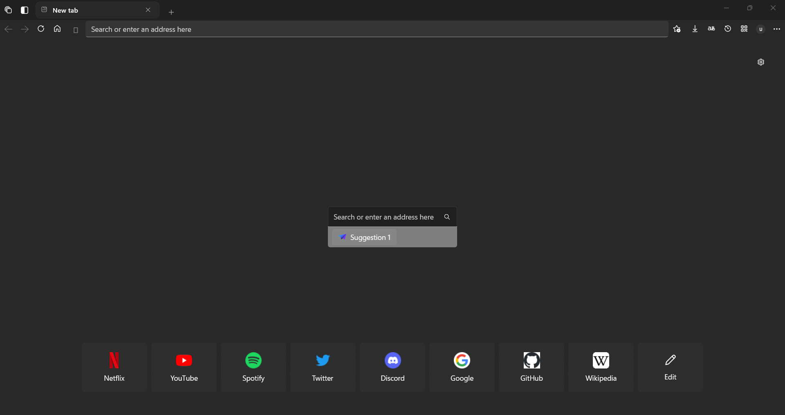
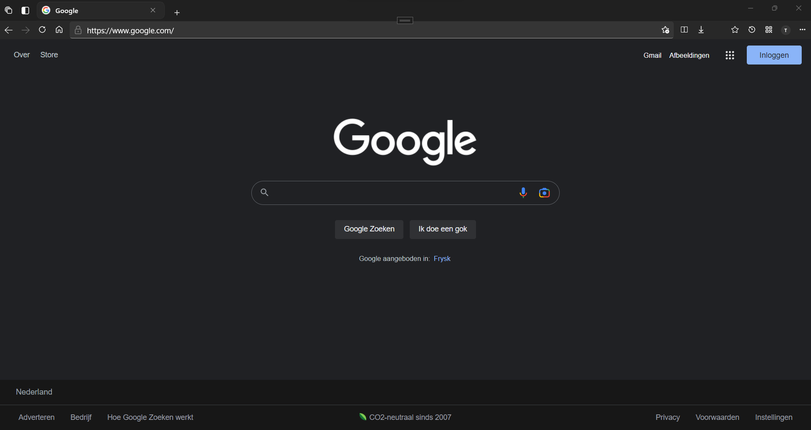
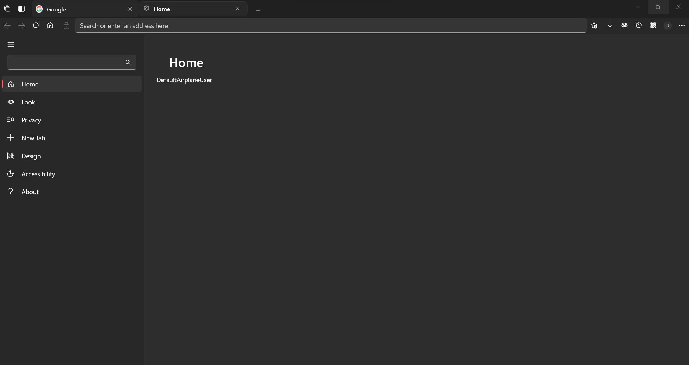
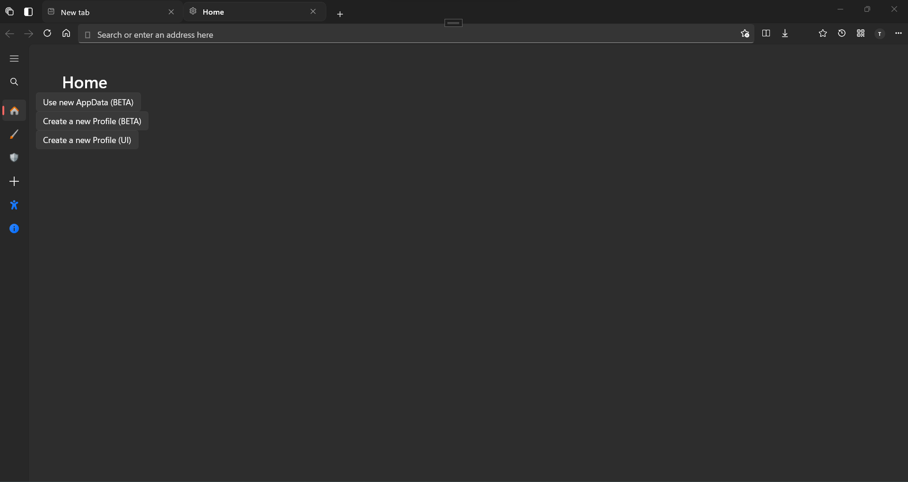

  
  <h1>FireBrowser</h1>

### A modern Web browser with a beautiful UI built with the UWP and the WebView2 SDK.

# Features:
- Blazingly fast
- Low ram usage
- Browse the web
- Search suggestions
- Reading mode
- QR Code generator
- Pinned sites
- Focus mode
- Note on websites
- Compact overlay
- Split browsing
- Freeform

# Screenshots

   
   
   
   

TBD

# License
GPL v3.0
